# 🚚 QuickParcel

A courier delivery mobile application developed as a Final Year Project using Flutter and Firebase.

---

## 📖 Project Overview

QuickParcel is a courier delivery mobile application designed to simplify parcel delivery services by connecting customers, delivery drivers, and administrators through a single platform.

The application enables customers to book parcels, track deliveries, and communicate with assigned drivers. Delivery drivers can manage delivery requests and update parcel status, while administrators oversee user management and system operations.

This project was developed as part of the Final Year Project for the Bachelor of Science in Computer Science and Engineering.

---

## 🎯 Project Objectives

- Simplify parcel booking and delivery management.
- Connect customers and delivery drivers efficiently.
- Provide real-time parcel tracking.
- Improve communication between customers and drivers.
- Build a secure and user-friendly mobile application.

---

## 🛠 Technology Stack

| Category | Technologies |
|----------|--------------|
| Mobile App | Flutter |
| Backend | Firebase |
| Database | Cloud Firestore |
| Authentication | Firebase Authentication |
| UI Design | Figma |
| Programming Language | Dart |

---

## ✨ Key Features

### Customer
- User Registration & Login
- Parcel Booking
- Delivery Tracking
- Driver Communication
- Profile Management

### Driver
- Driver Login
- Receive Delivery Requests
- Update Parcel Status
- Share Live Location
- Customer Communication

### Admin
- Admin Login
- Manage Users
- Manage Delivery Drivers
- Monitor Parcel Activities

## 📊 System Workflow

QuickParcel consists of three main modules: Customer, Driver, and Admin.

### Customer Workflow

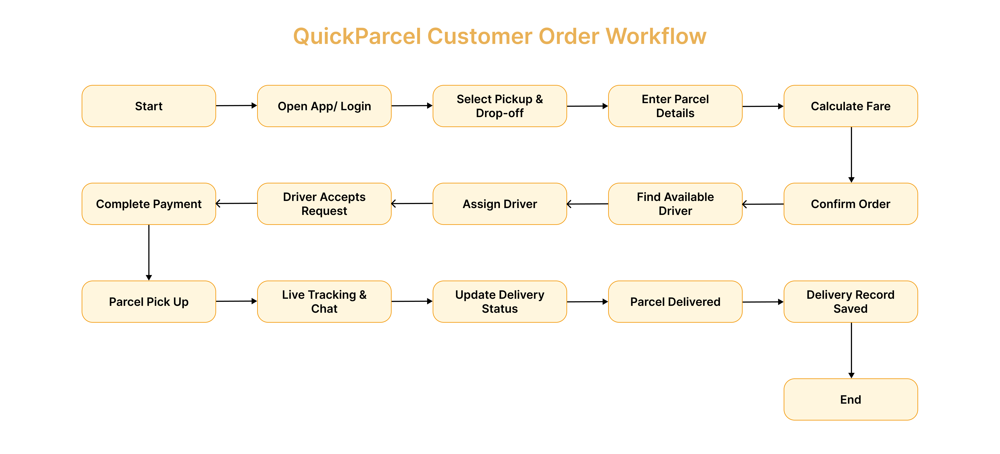

---

### Driver Workflow

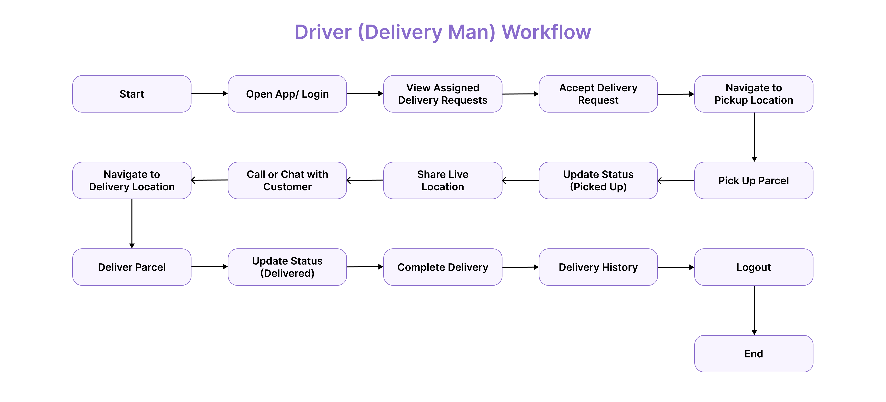

---

### Admin Workflow

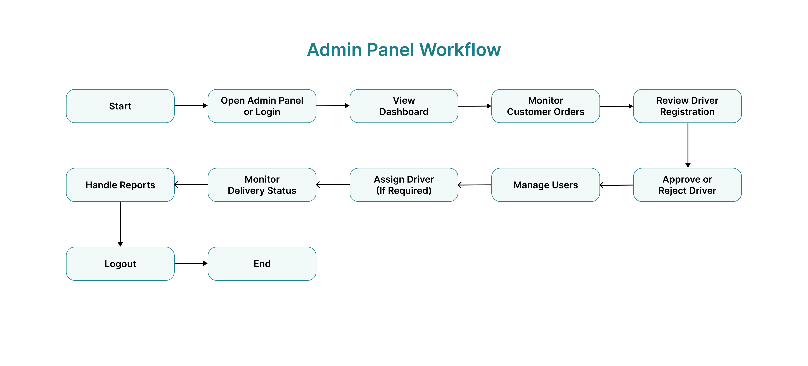

---

## 📱 Customer Module

The following screenshots demonstrate the main workflow of the customer application.

### 1. Splash Screen

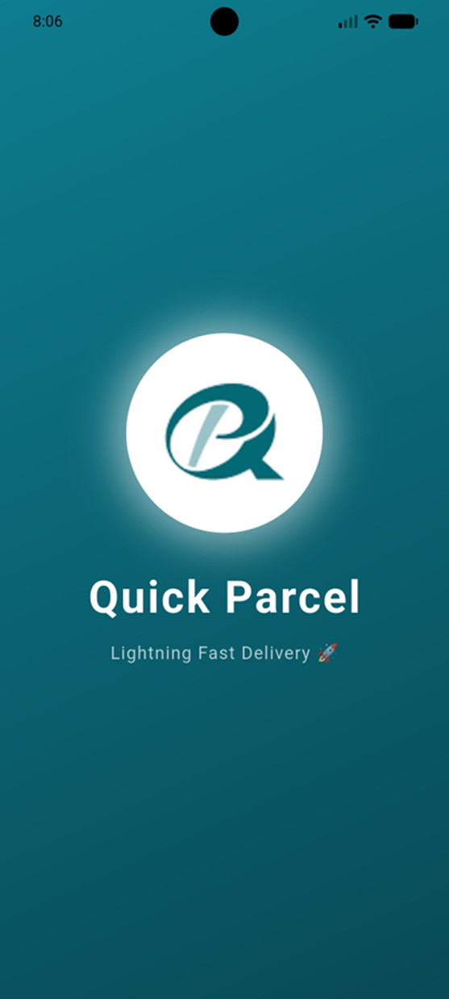

---

### 2. Login

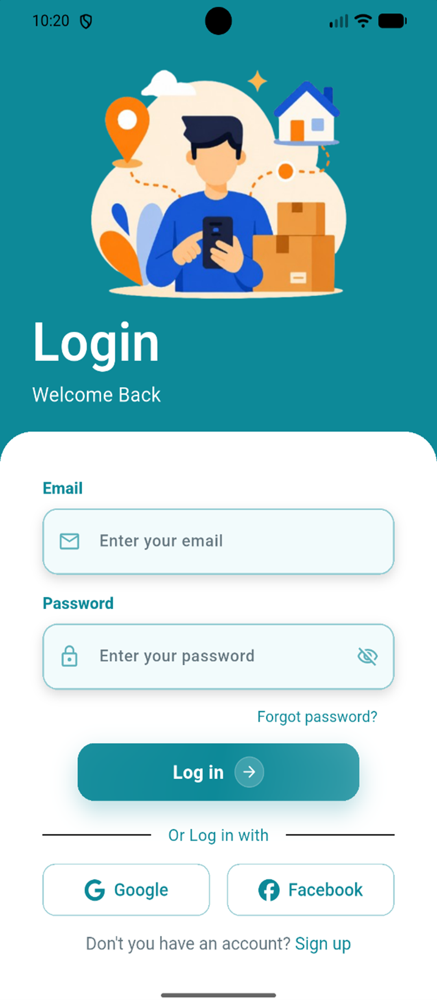

---

### 3. Sign Up

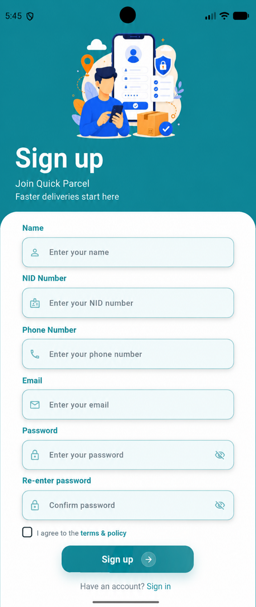

---

### 4. Home Screen

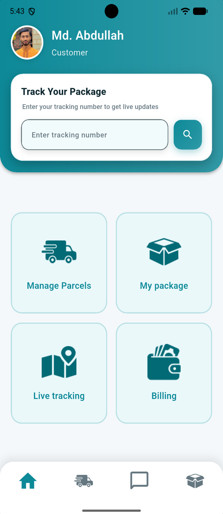

---

### 5. Parcel Services

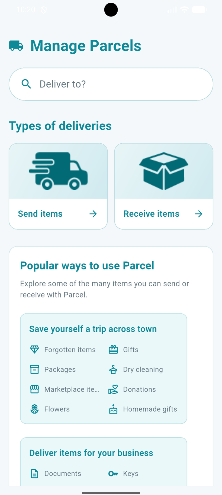

---

### 6. Driver Selection

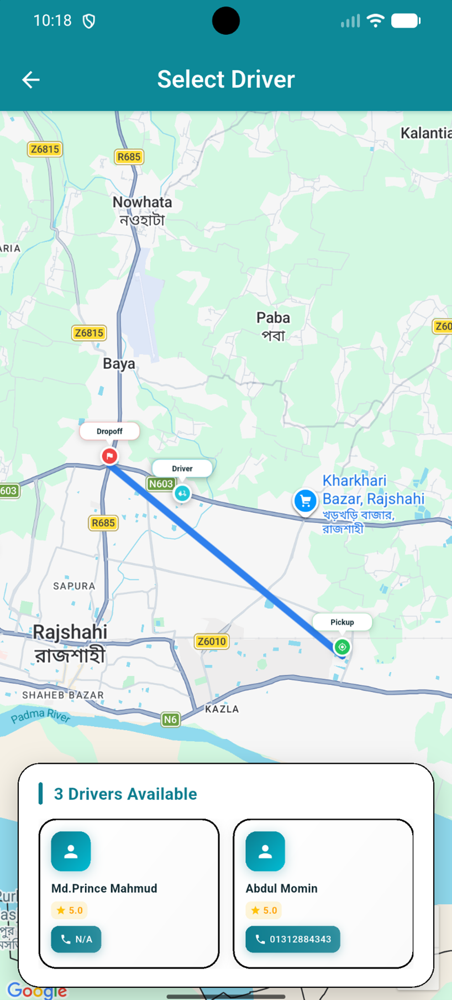

---

### 7. Driver Details

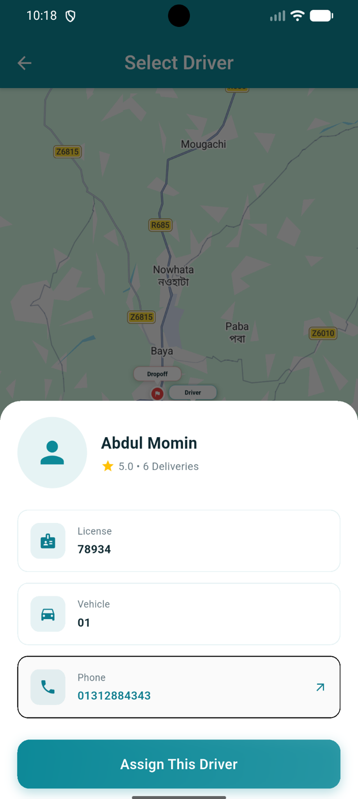

---

### 8. Online Payment

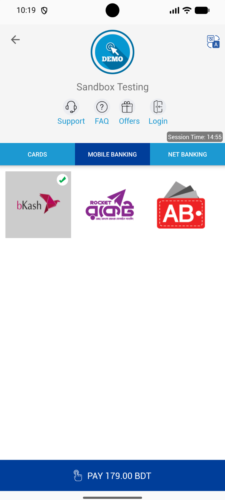

---

### 9. Live Tracking

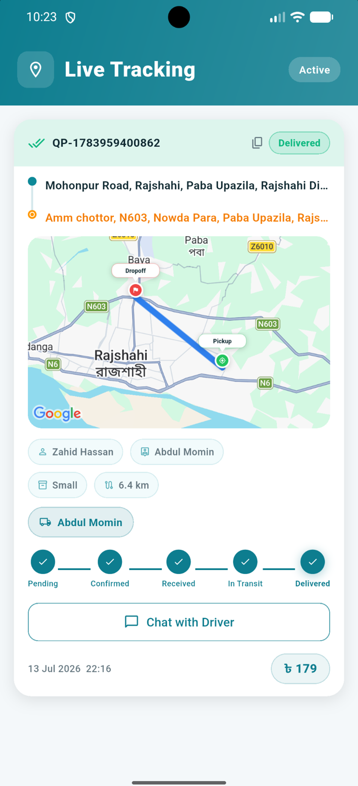

---

## 🚚 Driver Module

The Driver Module enables delivery personnel to receive parcel requests, manage assigned deliveries, and update delivery status throughout the delivery process.

### 1. Driver Login

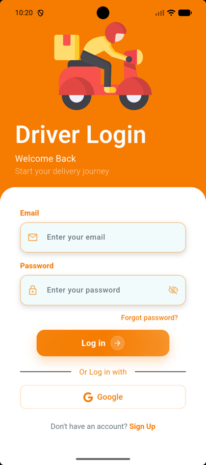

---

### 2. Driver Registration

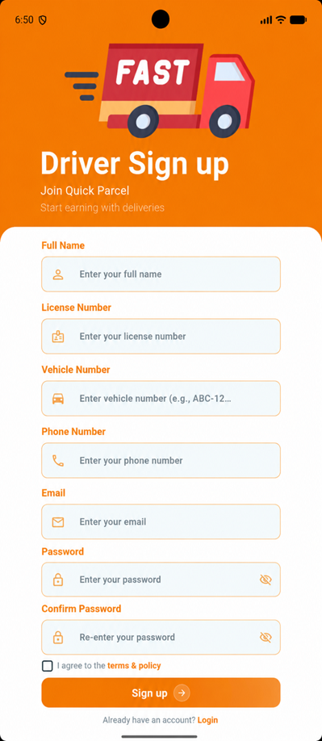

---

### 3. Driver Dashboard

---

### 4. Pending Orders

---

### 5. Active Order

---

### 6. Delivery Status

